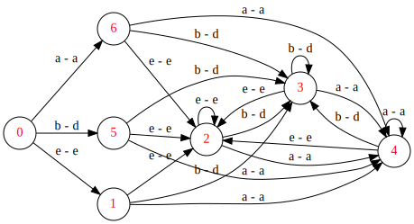

# Table of Contents

1.  [Status](#orgfe1b28f)
2.  [Prerequisites](#org4641c12)
3.  [Installation](#org6d583f1)
4.  [Usage](#org441d8fa)
    1.  [Unit Tests ](#org3df94cb)
    2.  [Visualizing the GraphViz Dot Diagrams](#orgaf1446c)
5.  [TODO](#orgf4618a0)
6.  [Author](#orgc570f2e)

# Status

This project is still at an early experimental condition. At this stage, it is possible to match strings against **regular expressions** provided in the form of s-expressions. See section entitled "[Unit Tests](#orgc008fd9)" for information about how to experiment with the regex matcher's different unit test cases.

# Prerequisites

-   Git
-   A Common Lisp installation, including ASDF (e.g. SBCL).
-   Quicklisp

# Installation

Once the Git repository is cloned, the **ASDF** file (`parsex-cl.asd`) can be compiled and loaded in a REPL session (e.g. Emacs **Slime** REPL).

The project can then be loaded using **Quicklisp**, as follows:

    (ql:quickload 'parsex-cl)  

The project components will be loaded sequentially, as indicated in the following output:

    To load "parsex-cl":
      Load 1 ASDF system:
        parsex-cl
    ; Loading "parsex-cl"
    [package parsex-cl]...............................
    [package parsex-cl.tokenizer-states]..............
    [package parsex-cl.tokenizer-transitions].........
    [package parsex-cl.tokenizer].....................
    [package parsex-cl.basic-string-tokenizer]........
    [package parsex-cl.common-transition-finders].....
    [package parsex-cl.common-atom-matchers]..........
    [package parsex-cl.regex].........................
    [package parsex-cl.fsm-traversal].................
    [package parsex-cl]...............................
    [package parsex-cl.graphviz-util].................
    [package parsex-cl.test]..........................
    [package parsex-cl.tokenizer.test]................
    [package parsex-cl.regex.test]..
    (PARSEX-CL)

TODO: Enhance.

# Usage

## Unit Tests 

Running regex unit test cases selectively can be done by first changing into the regex unit tests package:

    (in-package :parsex-cl.regex.test)

The output and updated prompt will indicate the **test** package:

    #<PACKAGE "PARSEX-CL.REGEX.TEST">
    TEST>

Then, any unit test can be executed as follows (for example: **basic2-regex-matching-test**):

    TEST> (run! 'basic2-regex-matching-test)

The output will provide information about the test case, including the following:

-   Text being matched.
-   Regular expression being matched against.
-   Text consumed by the matching process (updated accumulator).
-   GraphViz Dot for the NFA finite state machine diagram.
-   GraphViz Dot for the DFA finite state machine diagram.
-   Test execution status (success/failure).

Here is a sample output for the execution of the above test case:

    Running test BASIC2-REGEX-MATCHING-TEST 
    Matching the text "abcacdaecccaabeadde" against the regex (+
                                                               (OR (CHAR-RANGE a d)
                                                                (CHAR-RANGE b e)))..
    
    Updated accumulator is abcacdaecccaabeadde
    
    Graphviz for NFA:
    digraph {
    rankdir = LR;
    
        0 -> 1 [label="b - e"];
        1 -> 2 [label="ε"];
        2 -> 3 [label="ε"];
        2 -> 4 [label="ε"];
        4 -> 5 [label="b - e"];
        5 -> 6 [label="ε"];
        6 -> 3 [label="ε"];
        6 -> 4 [label="ε"];
        4 -> 7 [label="a - d"];
        7 -> 6 [label="ε"];
        0 -> 8 [label="a - d"];
        8 -> 2 [label="ε"];
    }
    
    
    Graphviz for DFA:
    digraph {
    rankdir = LR;
    
        0 -> 1 [label="e - e"];
        1 -> 2 [label="e - e"];
        2 -> 2 [label="e - e"];
        2 -> 3 [label="b - d"];
        3 -> 2 [label="e - e"];
        3 -> 3 [label="b - d"];
        3 -> 4 [label="a - a"];
        4 -> 2 [label="e - e"];
        4 -> 3 [label="b - d"];
        4 -> 4 [label="a - a"];
        2 -> 4 [label="a - a"];
        1 -> 3 [label="b - d"];
        1 -> 4 [label="a - a"];
        0 -> 5 [label="b - d"];
        5 -> 2 [label="e - e"];
        5 -> 3 [label="b - d"];
        5 -> 4 [label="a - a"];
        0 -> 6 [label="a - a"];
        6 -> 2 [label="e - e"];
        6 -> 3 [label="b - d"];
        6 -> 4 [label="a - a"];
    }
    
    ..
     Did 2 checks.
        Pass: 2 (100%)
        Skip: 0 ( 0%)
        Fail: 0 ( 0%)
    
    T
    NIL
    NIL

## Visualizing the GraphViz Dot Diagrams

In order to inspect the NFA or DFA visually, the **dot** utility provided with **Graphviz** may be used to export the Dot output into **SVG**.

**Note**: A Graphviz installation is required for this step.

For example, to visualize the DFA corresponding to the test case described in the previous section ([Unit Tests](#orgc008fd9)), the following commands can be used (assuming a Unix/Linux terminal):

-   Save the Dot output for the DFA into a text file:

    cat > sample-dfa.dot
    
    digraph {
    rankdir = LR;
    
        0 -> 1 [label="e - e"];
        1 -> 2 [label="e - e"];
        2 -> 2 [label="e - e"];
        2 -> 3 [label="b - d"];
        3 -> 2 [label="e - e"];
        3 -> 3 [label="b - d"];
        3 -> 4 [label="a - a"];
        4 -> 2 [label="e - e"];
        4 -> 3 [label="b - d"];
        4 -> 4 [label="a - a"];
        2 -> 4 [label="a - a"];
        1 -> 3 [label="b - d"];
        1 -> 4 [label="a - a"];
        0 -> 5 [label="b - d"];
        5 -> 2 [label="e - e"];
        5 -> 3 [label="b - d"];
        5 -> 4 [label="a - a"];
        0 -> 6 [label="a - a"];
        6 -> 2 [label="e - e"];
        6 -> 3 [label="b - d"];
        6 -> 4 [label="a - a"];
    }
    ^C

-   Export the file as SVG:

    dot -Tsvg -Nfontcolor=red -Nshape=circle sample-dfa.dot > sample-dfa.svg

-   View the SVG file in any modern web browser, or any vector graphics tool that supports opening/importing files in SVG format.

# TODO

-   For regex like `(+ "AB")`, currently "ABABAC" will not match, and will
    consume the first 5 characters (which is not wrong), but to be more
    useful, I need to match "ABAB", and stop there, for the next run. I
    expect this to be easy, since we already keep track of "candidate
    matching".
-   Complete the implementation of negation.
-   may split code into multiple packages.
-   There are also some TODOs in the source code (to be added in this section).

# Author

-   John Badie (johnkirollos@gmail.com)

