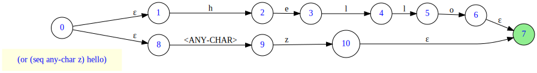

# Table of Contents

1.  [Purpose of this Project](#org31cdece)
2.  [Status](#org26a8a03)
3.  [Features](#org1832e7f)
    1.  [Regex Format](#orgc658690)
    2.  [Supported Constructs](#org7be83a9)
    3.  [Some Implementation Notes](#org8b52318)
        1.  [Backtracking](#orgd76af0d)
4.  [Prerequisites](#org94bec14)
5.  [Libraries (Dependencies)](#orgcc71a12)
6.  [Installation](#org09cde09)
7.  [Usage](#orgf2557e6)
    1.  [User Interface](#org4a41e5f)
    2.  [Unit Tests ](#org96d6309)
    3.  [Visualizing the GraphViz Dot Diagrams](#org6911c47)
8.  [TODO: Up Next](#orgc80166d)
9.  [Author](#org46b4341)

# Purpose of this Project

This is an experimental regex project, with "lispy" syntax, that could hopefully be part of a bigger lexer-parser system. At this stage, I'm fairly satisfied with the regex feature coverage it provides. However, it is not meant to compete with the well-established, feature-rich **[CL-PPCRE](https://github.com/edicl/cl-ppcre)**.

# Status

While it's still at an early experimental status, it is already capable of matching strings against classical **regular expressions**, that are provided in the form of **s-expressions**. See section entitled [Unit Tests](#org3ef0447) for information about how to experiment with the regex matcher.

# Features

## Regex Format

I'm convinced that in Lisp, there is little reason to use a non-lisp syntax to define regular expressions, for different reasons:

-   I get regex parsing almost for free, thanks to the **Common Lisp Reader**. This also allows adding more features in the future, without the need for complicated parser updates.
-   Ambiguity related to order of evalution is avoided, thanks to the parentheses.

Having said that, it's designed with separation between regex presentation and processing in mind. This means that different "front-ends" could be implemented, allowing regex to be expressed in different forms (e.g. string with wildcards or JSON).

## Supported Constructs

Regex constructs are either simple (that is, matching a single character), or composed of other constructs.

The following table describes the supported constructs. For brievity, I'm assuming that the reader is already familiar with regular expressions in general.

<table border="2" cellspacing="0" cellpadding="6" rules="groups" frame="hsides">

<colgroup>
<col  class="org-left" />

<col  class="org-left" />

<col  class="org-left" />
</colgroup>
<thead>
<tr>
<th scope="col" class="org-left">Regex Element</th>
<th scope="col" class="org-left">Description</th>
<th scope="col" class="org-left">Example</th>
</tr>
</thead>
<tbody>
<tr>
<td class="org-left">Character</td>
<td class="org-left">Individual characters</td>
<td class="org-left">#\a</td>
</tr>

<tr>
<td class="org-left">Any Character</td>
<td class="org-left">An element matching any single character</td>
<td class="org-left">:any-char</td>
</tr>

<tr>
<td class="org-left">Character Range</td>
<td class="org-left">Character range, based on char-code order</td>
<td class="org-left">(char-range #\A #\F)</td>
</tr>

<tr>
<td class="org-left">Sequence</td>
<td class="org-left">Sequence of one or more elements (of any type)</td>
<td class="org-left">(seq #\x #\y)</td>
</tr>

<tr>
<td class="org-left">String</td>
<td class="org-left">Sequence of characters</td>
<td class="org-left">"xy" (same as previous one)</td>
</tr>

<tr>
<td class="org-left">Choice</td>
<td class="org-left">Choice between multiple elements</td>
<td class="org-left">(or "Hello" "Hi")</td>
</tr>

<tr>
<td class="org-left">Zero or More</td>
<td class="org-left">Zero or more occurrences of a specific element (Kleene closure)</td>
<td class="org-left">(* "a")</td>
</tr>

<tr>
<td class="org-left">One or more</td>
<td class="org-left">One or more occurrences of a specific element</td>
<td class="org-left">(+ "Hello ")</td>
</tr>

<tr>
<td class="org-left">Zero or One</td>
<td class="org-left">Zero or one occurrence of a specific element</td>
<td class="org-left">(? (or "Mr." "Mrs."))</td>
</tr>

<tr>
<td class="org-left">Regex Negation</td>
<td class="org-left">Matches anything other than the specified regex element</td>
<td class="org-left">(not "abc")</td>
</tr>

<tr>
<td class="org-left">Regex Inversion</td>
<td class="org-left">Equivalent to the caret (^) inside square brackets in classical regex format</td>
<td class="org-left">(inv #\a (char-range #\d #\m))</td>
</tr>

<tr>
<td class="org-left">Repetition</td>
<td class="org-left">Equivalent to <code>{m, n}</code> in classical regex format</td>
<td class="org-left">(rep (or "X" "O") 1 3)</td>
</tr>
</tbody>
</table>

Note:

-   Single character and string elements are specified as they would be read by the Common Lisp **reader**.
-   Construct types (**seq**, **or**, etc.) are specified using symbols.
-   Character overlaps are handled decently.
-   The **negation** element is still subject to changes, and its behavior will most probably be controlled using flags (to be added).

## Some Implementation Notes

Here are some assorted implementation details, which need to be addressed by expanding them into architecture document, or that may need to be handled in the code (besides being documented):

### Backtracking

Backtracking in case of no match and in case of *candidate match* are both implemented in the input source. These features are transparent to the regex matching function itself. There are two benefits from this:

1.  The contract between the matching function and the input handling is simple.
2.  Different behavior can be implemented in different implementations of the input source, without altering the matching function. For example, more efficient source could be implemented for exact matches only. Note that currently, only one implemententation is provided for the input source.

# Prerequisites

-   Git
-   A Common Lisp installation, including ASDF (e.g. SBCL).
-   Quicklisp

# Libraries (Dependencies)

Only **alexandria** is used, however, **iterate** is also declared as dependency (I'm content with the standard **loop**, though).

# Installation

Once the Git repository is cloned, the **ASDF** file (`parsex-cl.asd`) can be compiled and loaded in a REPL session (e.g. Emacs **Slime** REPL).

The project can then be loaded using **Quicklisp**, as follows:

    (ql:quickload 'parsex-cl)  

The project components will be loaded sequentially, as indicated in the following output:

    To load "parsex-cl":
      Load 1 ASDF system:
        parsex-cl
    ; Loading "parsex-cl"
    [package parsex-cl]...............................
    
    <other packages here>
    (PARSEX-CL)

TODO: Enhance this section.

# Usage

## User Interface

TODO: so far, I was focusing on test cases, and the only available matching function takes a DFA. This means that before matching, NFA and DFA need to be generated in a separate step (which is useful in case a single regex will be used in many matching operations, for performance). Next, I will focus on the user interface (API / command line), and update this section.

## Unit Tests 

First, the unit tests system needs to be loaded as follows:

    (ql:quickload "parsex-cl/test")

Then, running test cases can be done by first changing into the regex unit tests package:

    (in-package :parsex-cl.test/regex.test)

The output and updated prompt will indicate the **test** package:

    #<PACKAGE "PARSEX-CL.TEST/REGEX.TEST">
    TEST>

Finally, all defined test cases could be executed as follows:

    TEST> (run! :parsex-cl.regex.test-suite)

Of course, specific test suites or individual test cases could be ran by using the corresponding test name.

The output will provide information about the test cases (controlled by dynamic variables), including the following (depending on
some configuration variables):

-   Text being matched.
-   Regular expression being matched against.
-   Text consumed by the matching process (updated accumulator).
-   GraphViz Dot for the NFA finite state machine diagram.
-   GraphViz Dot for the DFA finite state machine diagram.
-   Test execution status (success/failure).

Here is a sample output for the execution of one of the test cases:

    ...
    Running test BASIC2-REGEX-MATCHING-TEST 
    Matching the text "abcacdaecccaabeadde" against the regex (+
                                                               (OR (CHAR-RANGE a d)
                                                                (CHAR-RANGE b e)))..
    
    Updated accumulator is abcacdaecccaabeadde
    
    Graphviz for NFA:
    digraph {
    rankdir = LR;
    
        0 -> 1 [label="b - e"];
        1 -> 2 [label="ε"];
        2 -> 3 [label="ε"];
        2 -> 4 [label="ε"];
        4 -> 5 [label="b - e"];
        5 -> 6 [label="ε"];
        6 -> 3 [label="ε"];
        6 -> 4 [label="ε"];
        4 -> 7 [label="a - d"];
        7 -> 6 [label="ε"];
        0 -> 8 [label="a - d"];
        8 -> 2 [label="ε"];
    }
    
    
    Graphviz for DFA:
    digraph {
    rankdir = LR;
    
        0 -> 1 [label="e - e"];
        1 -> 2 [label="e - e"];
        2 -> 2 [label="e - e"];
        2 -> 3 [label="b - d"];
        3 -> 2 [label="e - e"];
        3 -> 3 [label="b - d"];
        3 -> 4 [label="a - a"];
        4 -> 2 [label="e - e"];
        4 -> 3 [label="b - d"];
        4 -> 4 [label="a - a"];
        2 -> 4 [label="a - a"];
        1 -> 3 [label="b - d"];
        1 -> 4 [label="a - a"];
        0 -> 5 [label="b - d"];
        5 -> 2 [label="e - e"];
        5 -> 3 [label="b - d"];
        5 -> 4 [label="a - a"];
        0 -> 6 [label="a - a"];
        6 -> 2 [label="e - e"];
        6 -> 3 [label="b - d"];
        6 -> 4 [label="a - a"];
    }

## Visualizing the GraphViz Dot Diagrams

In order to inspect the NFA or DFA visually, the **dot** utility provided with **Graphviz** may be used to export the Dot output into **SVG**.

**Note**: A Graphviz installation is required for this step.

For example, to generate NFA and DFA for the regex `(or (seq :any-char #\z) "hello")`, and visualize it, you can use the following code:

    (let* ((*print-case* :downcase)
           (regex '(or (seq :any-char #\z) "hello"))
           (regex-obj-tree (parsex-cl/regex/sexp:prepare-regex-tree regex)))
      (multiple-value-bind (start end) (parsex-cl/regex/nfa:produce-nfa regex-obj-tree)
        (let ((dfa (parsex-cl/regex/dfa:produce-dfa start)))
          (print end)
          (parsex-cl/graphviz-util:generate-graphviz-dot-diagram start "/tmp/sample-nfa.svg"
                                                                 :regex regex
                                                                 :dot-output-file "/tmp/sample-nfa.dot")
          (parsex-cl/graphviz-util:generate-graphviz-dot-diagram dfa "/tmp/sample-dfa.svg"
                                                                 :regex regex
                                                                 :dot-output-file "/tmp/sample-dfa.dot"))))

Then, view the generated SVG files with any modern web browser or vector graphics tool that supports it.

# TODO: Up Next

-   Complete the implementation of negation (add customizable behavior).
-   Implement **anchors**, via specific matching functions. This won't affect the regex engine itself.
-   There are also some TODOs in the source code that are worth checking out/cleaning up.
-   Lexer and parser!

# Author

-   John Badie (johnkirollos@gmail.com)

