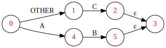

# Table of Contents

1.  [Purpose of this Project](#orgdf52612)
2.  [Status](#org2ed9efd)
3.  [Features](#orgf80925f)
    1.  [Regex Format](#org5563a4e)
    2.  [Supported Constructs](#orgfba10bc)
    3.  [Some Implementation Notes](#org2d7e8f1)
        1.  [Backtracking](#orgb979d68)
        2.  [Any Char Element](#org19ab7c0)
4.  [Prerequisites](#orgfd433fc)
5.  [Installation](#org1d1caeb)
6.  [Usage](#orgcf55b26)
    1.  [Unit Tests ](#orgd89db7f)
    2.  [Visualizing the GraphViz Dot Diagrams](#orgfe6419f)
7.  [TODO](#org8a23821)
8.  [Author](#org60c9f5a)

# Purpose of this Project

I started this project as an exercise to practice Common Lisp. It is not meant by any means to compete with the well-established, feature-rich **[CL-PPCRE](https://github.com/edicl/cl-ppcre)**. However, as this one gets more mature, it could become a component of a bigger idea.

# Status

While it's still at an early experimental condition, it is already capable of matching strings against classical **regular expressions**, that are provided in the form of **s-expressions**. See section entitled [Unit Tests](#orgea57309) for information about how to experiment with the regex matcher.

# Features

## Regex Format

I'm convinced that in Lisp, there is little reason to use a non-lisp syntax to define regular expressions, for different reasons:

-   I get regex parsing almost for free, thanks to the **Common Lisp Reader**. This also allows adding more features in the future, without the need for complicated parser updates.
-   Ambiguity related to order of evalution is avoided, thanks to the parentheses.

## Supported Constructs

Regex constructs are either simple (that is, matching a single character), or composed of other constructs.

The following table describes the supported constructs. For brievity, I'm assuming that the reader is already familiar with regular expressions in general.

<table border="2" cellspacing="0" cellpadding="6" rules="groups" frame="hsides">

<colgroup>
<col  class="org-left" />

<col  class="org-left" />

<col  class="org-left" />
</colgroup>
<thead>
<tr>
<th scope="col" class="org-left">Regex Element</th>
<th scope="col" class="org-left">Description</th>
<th scope="col" class="org-left">Example</th>
</tr>
</thead>

<tbody>
<tr>
<td class="org-left">Character</td>
<td class="org-left">Individual characters</td>
<td class="org-left">#\a</td>
</tr>

<tr>
<td class="org-left">Any Character</td>
<td class="org-left">An element matching any single character</td>
<td class="org-left">:any-char</td>
</tr>

<tr>
<td class="org-left">Character Range</td>
<td class="org-left">Character range, based on char-code order</td>
<td class="org-left">(char-range #\A #\F)</td>
</tr>

<tr>
<td class="org-left">Sequence</td>
<td class="org-left">Sequence of one or more elements</td>
<td class="org-left">(:seq #\x #\y)</td>
</tr>

<tr>
<td class="org-left">String</td>
<td class="org-left">Sequence of characters</td>
<td class="org-left">"xy" (same as previous one)</td>
</tr>

<tr>
<td class="org-left">Choice</td>
<td class="org-left">Choice between multiple elements</td>
<td class="org-left">(:or "Hello" "Hi")</td>
</tr>

<tr>
<td class="org-left">Zero or More</td>
<td class="org-left">Zero or more occurrences of a specific element (Kleene closure)</td>
<td class="org-left">(:* "a")</td>
</tr>

<tr>
<td class="org-left">One or more</td>
<td class="org-left">One or more occurrences of a specific element</td>
<td class="org-left">(:seq "Hell" (:+ #\o) #\!)</td>
</tr>

<tr>
<td class="org-left">Zero or One</td>
<td class="org-left">Zero or one occurrence of a specific element</td>
<td class="org-left">(:? (:or "Mr." "Mrs."))</td>
</tr>
</tbody>
</table>

Note in the previous table that **keyword symbols** are used to specify the construct types, except for the single character and string elements, which are specified as they would be read by the Common Lisp **reader**.

## Some Implementation Notes

Here are some assorted implementation details, which need to be addressed by expanding them into architecture document, or that may need to be handled in the code (besides being documented):

### Backtracking

Backtracking in case of no match and in case of *candidate match* are both implemented in the input source. These features are transparent to the regex matching function itself. There are two benefits from this:

1.  The contract between the matching function and the input handling is simple.
2.  Different behavior can be implemented in different implementations of the input source, without altering the matching function. For example, more efficient source could be implemented for exact matches only.

### Any Char Element

Currently the **:any-char** element (corresponding to the *DOT* element in Unix/Perl regular expressions) has the effective meaning of "any other char". For example, the regex below will not match the string `"AC"`.

    (:or "AB"
         (:seq :any-char #\C))

Here is the current NFA generated for it:

And here is the corresponding DFA:

I'm not sure at this point which behavior should be expected. Maybe I would allow both, by controlling the DFA generation using flags, or better, have two separate symbols (e.g. `:dot`, `:any-other`).

# Prerequisites

-   Git
-   A Common Lisp installation, including ASDF (e.g. SBCL).
-   Quicklisp

# Installation

Once the Git repository is cloned, the **ASDF** file (`parsex-cl.asd`) can be compiled and loaded in a REPL session (e.g. Emacs **Slime** REPL).

The project can then be loaded using **Quicklisp**, as follows:

    (ql:quickload 'parsex-cl)  

The project components will be loaded sequentially, as indicated in the following output:

    To load "parsex-cl":
      Load 1 ASDF system:
        parsex-cl
    ; Loading "parsex-cl"
    [package parsex-cl]...............................
    [package parsex-cl.tokenizer-states]..............
    [package parsex-cl.tokenizer-transitions].........
    [package parsex-cl.tokenizer].....................
    [package parsex-cl.basic-string-tokenizer]........
    [package parsex-cl.common-transition-finders].....
    [package parsex-cl.common-atom-matchers]..........
    [package parsex-cl.regex].........................
    [package parsex-cl.fsm-traversal].................
    [package parsex-cl]...............................
    [package parsex-cl.graphviz-util].................
    [package parsex-cl.test]..........................
    [package parsex-cl.tokenizer.test]................
    [package parsex-cl.regex.test]..
    (PARSEX-CL)

TODO: Enhance.

# Usage

## Unit Tests 

Running regex unit test cases selectively can be done by first changing into the regex unit tests package:

    (in-package :parsex-cl.regex.test)

The output and updated prompt will indicate the **test** package:

    #<PACKAGE "PARSEX-CL.REGEX.TEST">
    TEST>

Then, all defined test cases could be executed as follows:

    TEST> (run! :parsex-cl.regex.test-suite)

The output will provide information about the test cases, including the following:

-   Text being matched.
-   Regular expression being matched against.
-   Text consumed by the matching process (updated accumulator).
-   GraphViz Dot for the NFA finite state machine diagram.
-   GraphViz Dot for the DFA finite state machine diagram.
-   Test execution status (success/failure).

Here is a sample output for the execution of one of the test cases:

    ...
    Running test BASIC2-REGEX-MATCHING-TEST 
    Matching the text "abcacdaecccaabeadde" against the regex (+
                                                               (OR (CHAR-RANGE a d)
                                                                (CHAR-RANGE b e)))..
    
    Updated accumulator is abcacdaecccaabeadde
    
    Graphviz for NFA:
    digraph {
    rankdir = LR;
    
        0 -> 1 [label="b - e"];
        1 -> 2 [label="ε"];
        2 -> 3 [label="ε"];
        2 -> 4 [label="ε"];
        4 -> 5 [label="b - e"];
        5 -> 6 [label="ε"];
        6 -> 3 [label="ε"];
        6 -> 4 [label="ε"];
        4 -> 7 [label="a - d"];
        7 -> 6 [label="ε"];
        0 -> 8 [label="a - d"];
        8 -> 2 [label="ε"];
    }
    
    
    Graphviz for DFA:
    digraph {
    rankdir = LR;
    
        0 -> 1 [label="e - e"];
        1 -> 2 [label="e - e"];
        2 -> 2 [label="e - e"];
        2 -> 3 [label="b - d"];
        3 -> 2 [label="e - e"];
        3 -> 3 [label="b - d"];
        3 -> 4 [label="a - a"];
        4 -> 2 [label="e - e"];
        4 -> 3 [label="b - d"];
        4 -> 4 [label="a - a"];
        2 -> 4 [label="a - a"];
        1 -> 3 [label="b - d"];
        1 -> 4 [label="a - a"];
        0 -> 5 [label="b - d"];
        5 -> 2 [label="e - e"];
        5 -> 3 [label="b - d"];
        5 -> 4 [label="a - a"];
        0 -> 6 [label="a - a"];
        6 -> 2 [label="e - e"];
        6 -> 3 [label="b - d"];
        6 -> 4 [label="a - a"];
    }

## Visualizing the GraphViz Dot Diagrams

In order to inspect the NFA or DFA visually, the **dot** utility provided with **Graphviz** may be used to export the Dot output into **SVG**.

**Note**: A Graphviz installation is required for this step.

For example, to visualize the DFA corresponding to the test case described in the previous section ([Unit Tests](#orgea57309)), the following commands can be used (assuming a Unix/Linux terminal):

-   Save the Dot output for the DFA into a text file:

    cat > sample-dfa.dot
    
    digraph {
    rankdir = LR;
    
        0 -> 1 [label="e - e"];
        1 -> 2 [label="e - e"];
        2 -> 2 [label="e - e"];
        2 -> 3 [label="b - d"];
        3 -> 2 [label="e - e"];
        3 -> 3 [label="b - d"];
        3 -> 4 [label="a - a"];
        4 -> 2 [label="e - e"];
        4 -> 3 [label="b - d"];
        4 -> 4 [label="a - a"];
        2 -> 4 [label="a - a"];
        1 -> 3 [label="b - d"];
        1 -> 4 [label="a - a"];
        0 -> 5 [label="b - d"];
        5 -> 2 [label="e - e"];
        5 -> 3 [label="b - d"];
        5 -> 4 [label="a - a"];
        0 -> 6 [label="a - a"];
        6 -> 2 [label="e - e"];
        6 -> 3 [label="b - d"];
        6 -> 4 [label="a - a"];
    }
    ^C

-   Export the file as SVG:

    dot -Tsvg -Nfontcolor=red -Nshape=circle sample-dfa.dot > sample-dfa.svg

-   View the SVG file in any modern web browser, or any vector graphics tool that supports opening/importing files in SVG format.

# TODO

-   Complete the implementation of negation.
-   may split code into multiple packages.
-   There are also some TODOs in the source code (to be added in this section).

# Author

-   John Badie (johnkirollos@gmail.com)

