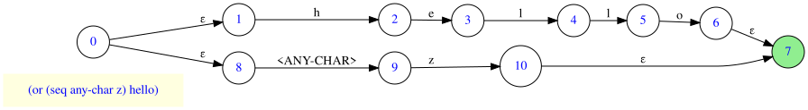
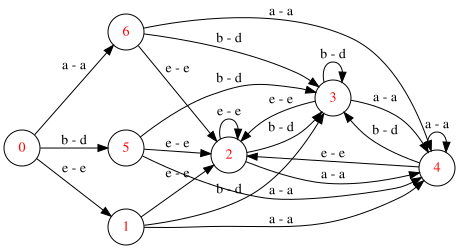

#+title: Parsex-Cl
#+subtitle: Recursive-Descent Grammar IR Generator

* Purpose of this Project
This project started as an experimental sexp-based regex interpreter, and as of version *0.5.0*, it comprises the following:

- Regular expression interpreter and DFA generator.
- Regular expression matcher that could serve as backend for different tools (parsers, grep-like tools etc.).
- PEG grammar interpreter and grammar IR generator.
- Customizable recursive-descent parser.
- Various generic utils that could end up in separate systems.

The syntax for both regular expression and grammar is currently provided in SEXP form, however, the design is flexible enough to introduce different front-ends. The decision to choose Lisp expression to represent such data should be obvious :)

#+begin_note
#+end_note
At this stage, I'm fairly satisfied with the maturity of this project, However, it is not meant to compete with well-established and feature-rich projects, such as *[[https://github.com/edicl/cl-ppcre][CL-PPCRE]]*.

* Status
At this stage, I think the project could be useful as a workbench for people interested in Lisp (Common Lisp in particular), regular expressions, or recursive-descent parsers. It's equipped with hundreds of test cases, based on FiveAM, so hopefully the reader should not feel lost.

Regarding code quality, I was experimenting with different Common Lisp features and alternatives along the project. So whenever the reader would ask "why did he use CLOS here but a 'closure factory' there?", well, this could be the answer.

* Features

** Regex and Grammar Formats
I'm convinced that in Lisp, there is little reason to use a non-lisp syntax to define regular expressions or grammars, for different reasons:

- We get regex or grammar parsing almost for free, thanks to the *Common Lisp Reader*. This also allows adding more features in the future, without the need for complicated regex or grammar parser updates.
- Ambiguity related to order of evalution is avoided, thanks to the parentheses.

Even so, as mentioned previously, the design takes into consideration separating between representation and processing, for both the regex and grammar specifications . This means that different "front-ends" could be implemented, allowing  different forms (traditional regex, PEG grammar, JSON etc.).

** Regex

*** Supported Regex Constructs
Regex constructs are either simple (that is, matching a single character), or composed of other constructs.

The following table describes the supported constructs. For brievity, I'm assuming a level of familiarity with regular expressions in general.

|-----------------+------------------------------------------------------------------------------+--------------------------------|
| Regex Element   | Description                                                                  | Example                        |
|-----------------+------------------------------------------------------------------------------+--------------------------------|
| Character       | Individual characters                                                        | #\a                            |
| Any Character   | An element matching any single character                                     | :any-char                      |
| Character Range | Character range, based on char-code order                                    | (char-range #\A #\F)           |
| Sequence        | Sequence of one or more elements (of any type)                               | (seq #\x #\y)                  |
| String          | Sequence of characters                                                       | "xy" (same as previous one)    |
| Choice          | Choice between multiple elements                                             | (or "Hello" "Hi")              |
| Zero or More    | Zero or more occurrences of a specific element (Kleene closure)              | (* "a")                        |
| One or more     | One or more occurrences of a specific element                                | (+ "Hello ")                   |
| Zero or One     | Zero or one occurrence of a specific element                                 | (? (or "Mr." "Mrs."))          |
| Regex Negation  | Matches anything other than the specified regex element                      | (not "abc")                    |
| Regex Inversion | Equivalent to the caret (^) inside square brackets in classical regex format | (inv #\a (char-range #\d #\m)) |
| Repetition      | Equivalent to ={m, n}= in classical regex format                             | (rep (or "X" "O") 1 3)         |
|-----------------+------------------------------------------------------------------------------+--------------------------------|

Note:

- Single character and string elements are specified as they would be read by the Common Lisp *reader*.
- Construct types (*seq*, *or*, etc.) are specified using symbols.
- Character overlaps are handled decently.
- The *negation* element is still subject to changes, and its behavior will most probably be controlled using flags (to be added).

*** Some Implementation Notes

Here are some assorted implementation details, which need to be addressed by expanding them into architecture document, or that may need to be handled in the code (besides being documented):

**** Backtracking
Backtracking in case of no match and in case of /candidate match/ are both implemented in the input source. These features are transparent to the regex matching function itself. There are two benefits from this:

1. The contract between the matching function and the input handling is simple.
2. Different behavior can be implemented in different implementations of the input source, without altering the matching function. For example, more efficient source could be implemented for exact matches only. Note that currently, only one implemententation is provided for the input source.

** Parser
*** Supported Grammar Constructs
PEG grammar can be specified using the constructs described in the table below.

I'm assuming a level of familiarity with PEG grammars.

|---------------------+--------------------------------------------------|
| Construct           | Description                                      |
|---------------------+--------------------------------------------------|
| Sequence            | Sequence of one or more constructs               |
| Ordered Choice (Or) | Ordered choice between multiple constructs       |
| Zero or More        | Zero or more occurrences of a specific construct |
| One or more         | One or more occurrences of a specific construct  |
| Zero or One         | Zero or one occurrence of a specific construct   |
|---------------------+--------------------------------------------------|

#+begin_note
I think this covers most of the PEG features, except maybe for /predicates/, which are not currently supported. May consider adding them in future update.
#+end_note

*** Grammar Specification
In this section, I'll describe briefly how can grammar be specified in SEXP form.

Grammar in this library may be specified as a list of forms;
each for could be either *token* or *rule*;
a /token/ starts with the symbol =token=, and is specified using an /id/ and a regex form;
a /rule/ starts with the symbol =rule=, and is specified using an /id/ and a grammar form, or an alias (reference) to another rule;

Here is an example:

#+begin_src lisp
  '((token id (seq
               #1=(or (char-range #\A #\Z) (char-range #\a #\z))
               (+ (or #1# (char-range #\0 #\9)))))
    (token int (+ (char-range #\0 #\9)))
    (token *-op #\*)
    (token assign #\=)
    (token semicolon #\;)
    (rule factor (or id int))
    (rule mul-expr (seq factor (? (seq *-op factor))))
    (rule statement (seq id assign mul-expr semicolon))
    (rule statement-block (seq statement (* statement))))
#+end_src

Here is an sample text that complies with the above grammar:
#+begin_example
"id1=id2*3;id11=id22*33;"
#+end_example

Note the following:
- The order of forms (tokens and rules) is irrelevant; the grammar "parser" is able to handle forward references.
- White spaces are currently not treated in any special way. In a future update, the tokenizer would be able to handle them (e.g. treat them as token separators).
- In the above grammar example, I'm using Common Lisp's object label notation (*#n=*, *#n#*) to avoid redundancy. I.e. these are not special features in the grammar itself, and it could be regarded as one of the benefits of relying on Common Lisp's reader.

From the last note, one could see that I leaned towards minimalism and using whatever feature that Common Lisp provides for free. Nevertheless, More features could be added in the future.

*** Parsing
The parser uses the IR (Intermediate Representation) generated from the grammar, to parse text provided by a *backtracking tokenizer*.

TODO: expand.

** Components
TODO, explain the different components:
- Regex parser tree generator
- NFA and DFA generators
- Regex text matcher (and tokenizer)
- Backtracking tokenizer
- Parser (including pre and post notifications interface)

* Prerequisites
- Git
- A Common Lisp installation, including ASDF (e.g. SBCL).
- Quicklisp

* Libraries (Dependencies)
Only *alexandria* is used, however, *iterate* is also declared as dependency (I'm content with the standard *loop*, though).

* Installation

Once the Git repository is cloned, the *ASDF* file (=parsex-cl.asd=) can be compiled and loaded in a REPL session (e.g. Emacs *Slime* REPL).

The project can then be loaded using *Quicklisp*, as follows:

#+begin_src lisp
(ql:quickload 'parsex-cl)  
#+end_src

The project components will be loaded sequentially, as indicated in the following output:

#+begin_example
To load "parsex-cl":
  Load 1 ASDF system:
    parsex-cl
; Loading "parsex-cl"
[package parsex-cl]...............................

<other packages here>
(PARSEX-CL)
#+end_example

TODO: Enhance this section.

* Usage

** Regex DFA Generation

*** User Interface
TODO: so far, I was focusing on test cases, and the only available matching function takes a DFA. This means that before matching, NFA and DFA need to be generated in a separate step (which is useful in case a single regex will be used in many matching operations, for performance). Next, I will focus on the user interface (API / command line), and update this section.

*** Unit Tests <<unit-tests>>

First, the unit tests system needs to be loaded as follows:

#+begin_src lisp
  (ql:quickload "parsex-cl/test")
#+end_src

Then, running test cases can be done by first changing into the regex unit tests package:

#+begin_src lisp
  (in-package :parsex-cl.test/regex.test)
#+end_src

The output and updated prompt will indicate the *test* package:

#+begin_example
#<PACKAGE "PARSEX-CL.TEST/REGEX.TEST">
TEST>
#+end_example

Finally, all defined test cases could be executed as follows:

#+begin_example
TEST> (run! :parsex-cl.regex.test-suite)
#+end_example

Of course, specific test suites or individual test cases could be ran by using the corresponding test name.

The output will provide information about the test cases (controlled by dynamic variables), including the following (depending on
some configuration variables):
- Text being matched.
- Regular expression being matched against.
- Text consumed by the matching process (updated accumulator).
- GraphViz Dot for the NFA finite state machine diagram.
- GraphViz Dot for the DFA finite state machine diagram.
- Test execution status (success/failure).

Here is a sample output for the execution of one of the test cases:

#+begin_example
...
Running test BASIC2-REGEX-MATCHING-TEST 
Matching the text "abcacdaecccaabeadde" against the regex (+
                                                           (OR (CHAR-RANGE a d)
                                                            (CHAR-RANGE b e)))..

Updated accumulator is abcacdaecccaabeadde

Graphviz for NFA:
digraph {
rankdir = LR;

    0 -> 1 [label="b - e"];
    1 -> 2 [label="ε"];
    2 -> 3 [label="ε"];
    2 -> 4 [label="ε"];
    4 -> 5 [label="b - e"];
    5 -> 6 [label="ε"];
    6 -> 3 [label="ε"];
    6 -> 4 [label="ε"];
    4 -> 7 [label="a - d"];
    7 -> 6 [label="ε"];
    0 -> 8 [label="a - d"];
    8 -> 2 [label="ε"];
}

Graphviz for DFA:
digraph {
rankdir = LR;

    0 -> 1 [label="e - e"];
    1 -> 2 [label="e - e"];
    2 -> 2 [label="e - e"];
    2 -> 3 [label="b - d"];
    3 -> 2 [label="e - e"];
    3 -> 3 [label="b - d"];
    3 -> 4 [label="a - a"];
    4 -> 2 [label="e - e"];
    4 -> 3 [label="b - d"];
    4 -> 4 [label="a - a"];
    2 -> 4 [label="a - a"];
    1 -> 3 [label="b - d"];
    1 -> 4 [label="a - a"];
    0 -> 5 [label="b - d"];
    5 -> 2 [label="e - e"];
    5 -> 3 [label="b - d"];
    5 -> 4 [label="a - a"];
    0 -> 6 [label="a - a"];
    6 -> 2 [label="e - e"];
    6 -> 3 [label="b - d"];
    6 -> 4 [label="a - a"];
}

#+end_example

*** Visualizing the GraphViz Dot Diagrams

In order to inspect the NFA or DFA visually, the *dot* utility provided with *Graphviz* may be used to export the Dot output into *SVG*.

*Note*: A Graphviz installation is required for this step.

For example, to generate NFA and DFA for the regex =(or (seq :any-char #\z) "hello")=, and visualize it, you can use the following code:

#+begin_src lisp
(let* ((*print-case* :downcase)
       (regex '(or (seq :any-char #\z) "hello"))
       (regex-obj-tree (parsex-cl/regex/sexp:prepare-regex-tree regex)))
  (multiple-value-bind (start end) (parsex-cl/regex/nfa:produce-nfa regex-obj-tree)
    (let ((dfa (parsex-cl/regex/dfa:nfa-to-dfa start)))
      (print end)
      (parsex-cl/graphviz-util:generate-graphviz-dot-diagram start "/tmp/sample-nfa.svg"
                                                             :regex regex
                                                             :dot-output-file "/tmp/sample-nfa.dot")
      (parsex-cl/graphviz-util:generate-graphviz-dot-diagram dfa "/tmp/sample-dfa.svg"
                                                             :regex regex
                                                             :dot-output-file "/tmp/sample-dfa.dot"))))
#+end_src

Then, view the generated SVG files with any modern web browser or vector graphics tool that supports it.

#+CAPTION: Sample NFA finite state machine diagram
#+NAME:   fig:nfa-fsm-diagram

#+CAPTION: Sample DFA finite state machine diagram
#+NAME:   fig:dfa-fsm-diagram

** Regex Matching
TODO - for now, reader could refer to [[./test/regex-test.lisp][regex-test.lisp]] for examples on matching of text against a regex specified with a DFA.

** Parsing
TODO - for now, reader could refer to [[./test/parser-test.lisp][parser-test.Lisp]] for examples on parsing of text against a PEG grammar.

* TODO

- Test parser on a real-world grammar and text. This could be accompanied with a practical application (e.g. syntax coloring).
- Implement *anchors*, via specific matching functions. This won't affect the regex engine itself.
- There are also some TODOs in the source code that are worth checking out/cleaning up.
- Optimization, refactoring etc...
- Revise/Complete the implementation of negation (add customizable behavior). Not a priority since the negation use case may not be useful/meaningful.

* Author
+ John Kirollos (johnkirollos@gmail.com)

